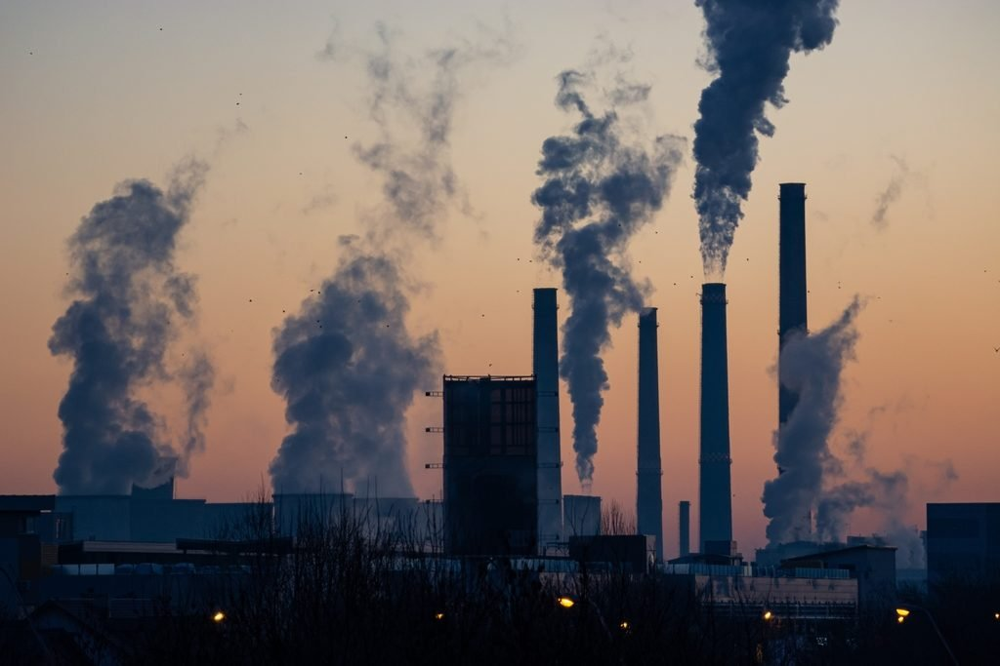

# Analyzing Industry Carbon Emissions
  

When factoring heat generation required for the manufacturing and transportation of products, _Greenhouse gas emissions attributable to products, from food to sneakers to appliances, make up more than 75% of global emissions._ -[The Carbon Catalogue](https://www.nature.com/articles/s41597-022-01178-9)

Our data, which is publicly available on [here](https://springernature.figshare.com/articles/dataset/The_Carbon_Catalogue_public_database_Carbon_footprints_of_866_commercial_products_across_8_industry_sectors_and_5_continents/16908979), contains product carbon footprints (PCFs) for various companies. PCFs are the greenhouse gas emissions attributable to a given product, measured in CO2 (carbon dioxide equivalent).

This data is stored in a PostgreSQL database containing one table, `prouduct_emissions`, which looks at PCFs by product as well as the stage of production that these emissions occurred. Here's a snapshot of what `product_emissions` contains in each column:

### `product_emissions`

| field                              | data type |
|------------------------------------|-----------|
| `id`                               | `VARCHAR` |
| `year`                             | `INT`     |
| `product_name`                     | `VARCHAR` |
| `company`                          | `VARCHAR` |
| `country`                          | `VARCHAR` |
| `industry_group`                   | `VARCHAR` |
| `weight_kg`                        | `NUMERIC` |
| `carbon_footprint_pcf`             | `NUMERIC` |
| `upstream_percent_total_pcf`       | `VARCHAR` |
| `operations_percent_total_pcf`     | `VARCHAR` |
| `downstream_percent_total_pcf`     | `VARCHAR` |
